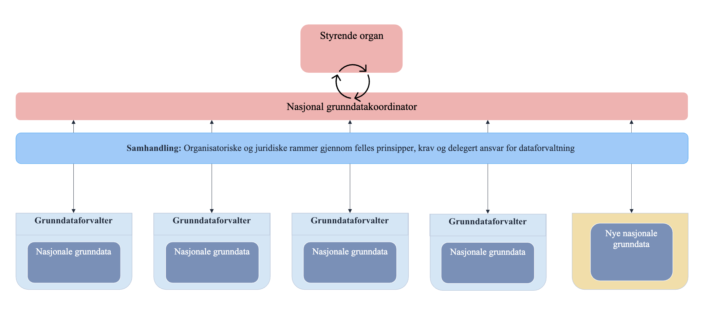

== Del 1: Organisering, roller og aktører
Dette kapitlet beskriver rammeverkets hovedaktører og samspillet dem imellom. Oppsummert består modellen av et styrende organ, en nasjonal grunndatakoordinator og grunndataforvaltere. Se figur under: 

.Organisering av nasjonale grunndata 

=== Styrende organ
Nasjonale grunndata trenger et styrende organ som gir nasjonal grunndatakoordinator oppdrag og prioriterer arbeid knyttet til utviklingen av Nasjonale grunndata. Tilsvarende må saker fra nasjonal grunndatakoordinator kunne løftes til det styrende organet.

=== Nasjonal grunndatakoordinator (grunndatakoordinator)
Grunndatakoordinatoren er en sentral aktør som sitter på den totale oversikten over alle Nasjonale grunndata, deres tilbydere, konsumenter samt pågående utviklingsinitiativer. Rollens hovedformål er å sikre enhetlig, stabil retning på utviklingen og forvaltningen av nasjonale grunndata.   

==== Grunndatakoordinatorens hovedansvar og oppgaver
===== 1. Ansvarlig for rammeverket:
* Forvalter rammeverket, og utvikler og justerer det etter behov. Dette gjelder bl.a. prinsipper og kriterier for nasjonale grunndata, prosesser, rollefordeling og avtalemaler. 
* Fanger opp, og – der det er hensiktsmessig – inkorporerer krav fra kommende EU-regelverk. 
* Sørger for at rammeverket er lett å forstå for alle involverte. 

===== 2. Ansvarlig for nasjonal grunndataoversikt:
* Utvikle og etablere grunndataoversikten med utgangspunkt i dagens felles offentlige registre. 
* Sørge for å ha løpende oversikt over alle data som har blitt etablert som nasjonale grunndata, samt kandidater til vurdering.  
* Sørge for at oversikten er et kommuniserende verktøy som tydelig viser logiske sammenhenger og mulige koblinger mellom grunndata.

===== 3. Ansvarlig for å holde oversikt over og dokumentere behov for Nasjonale grunndata i forvaltningen: 
* Vedlikeholde liste over behov, enten innmeldte eller identifisert av grunndatakoordinatoren selv ved hjelp av grunndataoversikten. 

** synliggjør overlapp i data 
** synliggjør manglende data 
** tydeliggjør ansvar og manglende ansvar for data 
** identifiserer behov for begrepsavklaringer 
** Fasilitere dokumentering av effekt og samfunnsgevinst som følge av bruk av grunndata. 
** Drive fram forståelse av verdien av Nasjonale grunndata og gevinster ved å ha en helhetlig utvikling av Nasjonale grunndata 

===== 4. Ansvarlig for å koordinere og fasilitere utviklingen av Nasjonale grunndata: 

* Koordinere arbeidet med å omsette behov til handling og utviklingstiltak. I dette ligger å se sammenhenger, knytte sammen relevante aktører og forankre behov for innsats.

==== Sammensetning og kompetanse
Grunndatakoordinator-rollen bør bestå av ressurser med kompetanse fra både data- og forretningssiden i offentlig forvaltning. Deltakerne må forstå dataenes rolle i verdiskapende prosesser, hvordan forvaltning av data kan organiseres og hvilke konsekvenser organiseringen har for tilbyder og konsument av data.  

Rollen bør bestå av en kontinuerlig kjerne, men tverrsektorielt samarbeid og fagekspertise er hovedfaktorer for at rollen som nasjonal grunndatakoordinator kan fungere. Rollen bør derfor støttes av en koordineringsgruppe bestående av deltakere fra ulike sektorer og fagområder. 

Rollen har sannsynligvis en grenseflate mot roller som kommer fra EU-forordninger, spesielt gjelder det rollen National Competent Body fra Data Governance Act. 

==== Samspill med andre aktører
Grunndatakoordinatoren fungerer som et bindeledd mellom alle aktørene i rammeverket.  

Behovs- og beslutningsunderlagene som grunndatakoordinatoren utarbeider i forbindelse med utvikling av nasjonale grunndata (se del 3), prioriteres videre av [styrende organ] før de omsettes til utvikling.  

=== Grunndataforvalter
Grunndataforvalteren er virksomheten som forvalter en type grunndata (NAV er eksempelvis grunndataforvalter for arbeidsforholdsdata). Grunndataforvalteren er den aktøren som sitter nærmest dataene og har mest kunnskap om f.eks. dataenes kvalitet, bruk, driftsrutiner og tekniske aspekter. 

==== Grunndataforvalters hovedansvar og oppgaver 
. Imøtekomme krav til dataforvaltning, kvalitet og tilgjengelighet. 
. Sikre at forvaltningen av data følger prinsipper og prosesser som beskrevet i rammeverket. 
. Kontinuerlig identifisere konsumenters behov. 
. Koordinere forvaltningsaktiviteter med andre grunndataforvaltere. 
. Kommunisere utviklingsbehov til grunndatakoordinator. 

==== Sammensetning og kompetanse
Grunndataforvalter velger selv hvordan de rigger seg lokalt for å ivareta grunndataforvalterrollen. Grunndatakoordinator skal ikke engasjere seg i grunndataforvalterens lokale forvaltning og driftsrutiner.  

==== Samspill med andre aktører
Grunndataforvalter må ha en tett samhandling med grunndatakoordinator og det styrende organet. 
