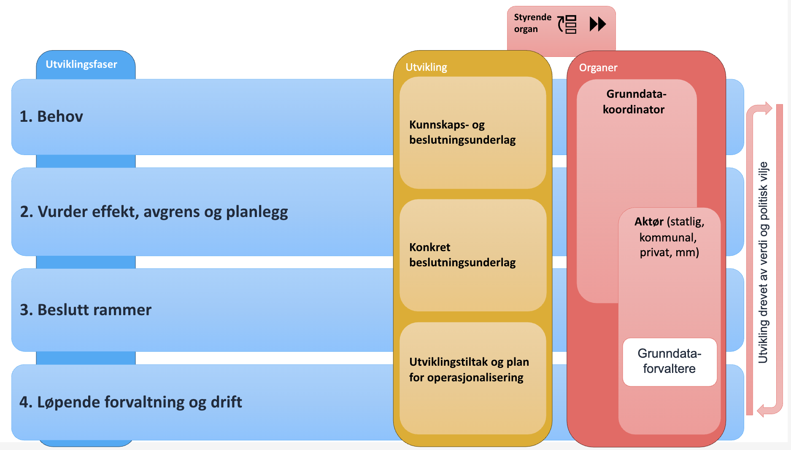

== Del 3: Prosesser
I 2025 er de nasjonale grunndataene som finnes i norsk offentlig forvaltning ikke er definert. Rammeverkets prosesser vil derfor de neste årene konsentrere seg rundt følgende aktiviteter: 

* Identifisere nasjonale grunndata-kandidater  
* Igangsette forbedringstiltak slik at dataene innfrir krav til tilstrekkelig kvalitet, kombinerbarhet og tilgjengelighet 
* Sørge for å oppnå kun én gang-prinsippet for de grunndataene som fortløpende inngår i grunndataoversikten (dvs. at Innbyggere og virksomheter oppgir opplysninger til det offentlige kun én gang, til kun én offentlig aktør, og at konsumenter er forpliktet til å hente dataene hos den ene kilden). 

På sikt, ettersom grunndataoversikten fylles med innhold, vil kontinuerlig forvaltning av grunndataene på nasjonalt nivå utgjøre en større del av rammeverkets prosesser. 

=== Utviklingsfaser for nasjonale grunndata
Dette kapittelet skisserer prosessene for hvordan aktiviteten beskrevet punktvis ovenfor skal utføres. Prosessen er inndelt i fire utviklingsfaser. 

.Utviklingsfaser for nasjonale grunndata 

Illustrasjonen over viser utviklingsfasene som en firetrinnsprosess, hvorav de tre første er planprosesser og den fjerde er drift og forvaltning. Formålet med utviklingsfasene er å identifisere nasjonale grunndata-kandidater, vurdere nytteverdien av å innlemme dem som nasjonale grunndata, hva som må til for at de skal innfri krav til kvalitet og tilgjengelighet og hvordan de skal driftes av grunndataforvalter. 

==== Fase 1: Behov
I forkant av fase 1 er enten et behov for nasjonale grunndata eller en mulig kandidat for nasjonale grunndata identifisert og meldt inn til grunndatakoordinator. Formålet med fase 1 er å vurdere og dokumentere potensialet til kandidaten eller hvordan et innmeld databehov kan ivaretas av nasjonale grunndata. Dataenes forvaltnings- og forretningsbehov blir identifisert og vurdert opp mot kriteriene (beskrevet i del 1).  

Grunndatakoordinatoren har ansvar for å utarbeide kunnskaps- og beslutningsgrunnlaget. Dette, brukes til å avgrense hvilke data det er snakk om, og hva som skal oppnås med å gi dem status som nasjonale grunndata. Det svarer ut hvem som har nytte av dataene, hva som er antatte gevinster og hva som kreves for å forvalte dataene som nasjonale grunndata. 

Et godt kunnskapsgrunnlag danner utgangspunktet for videre utforskning i fase 2. 

==== Fase 2: Vurder effekt, avgrens og planlegg
Er potensialet til kandidaten vurdert som tilstrekkelig i fase 1, brukes fase 2 på å vurdere effekten av dataene i et kost/nytte-perspektiv. I fase 2 skal et fullverdig beslutningsgrunnlag foreligge. Beslutningsgrunnlaget, skal inneholde en grovestimering av innsatsen som må til for å realisere potensialet som er beskrevet. Juridiske og organisatoriske realiseringskrav må også beskrives. Forslag til hvem som blir grunndataforvalter inkluderes. Fase 2 utgjør grunnlaget for å iverksette konkrete endringer. 

==== Fase 3: Beslutt rammer
I fase 3 skal konkrete utviklingstiltak og plan for operasjonalisering formes slik at de aktuelle grunndataene tilfredsstiller fastsatte krav og prosesser i rammeverket. Tiltak og plan må dokumenteres og forankres med grunndatakoordinator og styrende organ. De økonomiske, juridiske og organisatoriske rammene må avklares, og tildeling av rollen som nasjonal grunndataforvalter besluttes formelt av styrende organ.  

==== Fase 4: Løpende forvaltning og drift
I fase 4 er de konkrete tiltakene fra fase 3 iverksatt og må opprettholdes. De involverte aktørene sørger for at ordningen øker sin verdi ved å tilpasse den nye juridiske og organisatoriske krav som måtte komme, f.eks. nye krav til datakvalitet og nye aktørers behov. Løpende forvaltning og drift må også holde tritt med teknologiutviklingen. Finansiering av drift må kontinuerlig sikres over budsjett og tildelingsbrev. 
